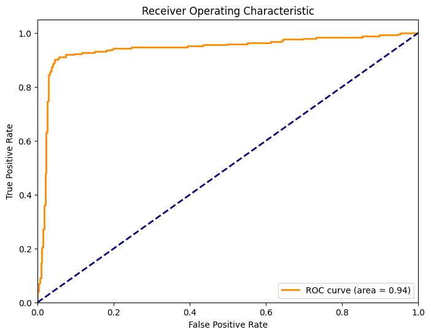

# Cross-Chain Transaction Laundering Detection - Methods Demonstration

A prototype pipeline for flagging potential money-laundering patterns in cross-chain (bridge) cryptocurrency activity: it sets up a multi-chain transaction database, engineers behavioral features associated with laundering (rapid bridge hops, round-trips, fan-out to many destinations), and trains a gradient-boosting classifier to separate suspicious from normal patterns.

> **Important framing:** This is a **methods demonstration built on synthetic data**, not a validated fraud-detection system.
> - The live on-chain data collection did **not** succeed in this run - the Etherscan API key was a placeholder, so Ethereum pulls failed; only limited Bitcoin data was retrieved.
> - The machine-learning model is therefore trained on **synthetic transactions whose "laundering" labels are generated by hand-written rules.** The classifier learns to recover those rules. The reported accuracy reflects the model re-learning its own label-generating logic - it is **not** evidence of real-world laundering detection. Read the metrics as "the pipeline trains and evaluates correctly," not "this catches real fraud."

---

## What it does

- Defines a **SQLite schema** for multi-chain analysis: addresses, transactions, and bridge transactions
- Includes fetchers for **Ethereum (Etherscan)** and **Bitcoin (BlockCypher)** transaction data (requires a valid API key to pull live data)
- Runs **SQL** exploratory queries to surface high-value transfers and addresses active across multiple chains
- Generates a labeled **synthetic** dataset with behavioral features and rule-based laundering labels
- Trains a **GradientBoostingClassifier** and evaluates it (classification report, ROC curve, feature importance)
- Includes a **NetworkX** transaction-graph visualization and a scaffolded **Streamlit** dashboard

### Behavioral features engineered

Transaction count · unique chains used · max/avg transfer value · avg/min time between transactions · bridge count · round-trip count (A→B→A) · chain-hop frequency · unique destinations · transactions per chain.

---

## Example output

*Feature importances the classifier assigns to the engineered behavioral variables. This shows the pipeline runs end to end on the synthetic data — it is **not** a measure of real-world detection performance (labels are rule-generated; see the framing note above).*

---

## Tech stack

| Layer | Tools |
| --- | --- |
| Language | Python 3 |
| Data / storage | pandas, NumPy, SQLite (sqlite3) |
| On-chain APIs | Etherscan, BlockCypher (via `requests`) |
| ML | scikit-learn (GradientBoosting, RandomForest) |
| Graph / viz | NetworkX, matplotlib, Plotly |
| App scaffold | Streamlit |

---

## What is genuinely demonstrated

Setting aside the synthetic-data caveat, the project does show real, transferable engineering:

- A normalized multi-chain **database schema** and SQL analysis over it
- A clean **feature-engineering** design grounded in documented laundering behaviors (bridge hopping, round-trips, rapid movement)
- A correct end-to-end **ML workflow**: train/test split, scaling, model fit, and evaluation with ROC/feature-importance
- Graph-based transaction visualization and an app scaffold for serving results

---

## Data & limitations

- **Live data not collected.** The Ethereum fetch failed (placeholder API key → `NOTOK`); only partial Bitcoin data was retrieved. To use real data, insert a valid Etherscan key and re-run.
- **Synthetic training data with rule-based labels.** Labels are produced by explicit if-conditions, then a model is trained to recover them. High accuracy here is expected and **circular** — it does not measure real detection performance.
- **No ground-truth evaluation.** Because there are no real labeled laundering cases, the model is never tested against actual fraud.
- **Prototype scope.** The Streamlit dashboard and real-time scoring are scaffolds, not a deployed system.

To become a real detector, this would need genuine on-chain data joined to known-illicit address labels (e.g. sanctioned addresses, published hack traces) and evaluation against those real labels.

---

## How to run

1. Open the notebook in Google Colab (or Jupyter).
2. Run the first cell to install dependencies (`scikit-learn`, `networkx`, `web3`, `plotly`, etc.).
3. (Optional, for live data) set a valid `ETHERSCAN_API_KEY` in the data-collection cell.
4. Run cells top to bottom. Without a key, the notebook proceeds on synthetic data and trains/evaluates the model on that.
